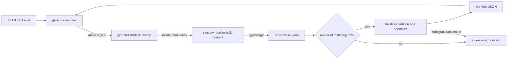

# Phase 19: Native Resolver Contract and Failure Boundary - Research

**Researched:** 2026-08-30
**Domain:** fail-closed task-content resolver adapter
**Confidence:** HIGH

<user_constraints>

## User Constraints (from CONTEXT.md)

### Locked Decisions

### Description Boundary

- **D-01:** Return non-duplicated authored execution prose in `description`.
  Extracted `Read First`, `Verify`, and `Done` content appears only in its
  dedicated resolver field.
- **D-02:** Preserve retained section headings, bodies, relative order, and
  leading prose. Retain `Precondition`, `Behavior`, `Action`, `Files`, and
  unknown sections rather than flattening or reinterpreting them.
- **D-03:** Do not synthesize Beads title, id, status, priority, or other
  metadata into `description`; the plan already carries task identity and
  name.
- **D-04:** A source description and its retained post-partition description
  must both be nonblank. A task containing only extracted sections is unusable
  and halts rather than returning gsd-core's non-throwing empty outcome.

### Heading Grammar

- **D-05:** Implement the smallest correct inverse of `_task_description`, not
  a general Markdown parser. Recognize the exact, case-sensitive, column-zero
  `## Read First`, `## Verify`, and `## Done` headings outside fenced code.
- **D-06:** Treat canonical column-zero H2 headings as section delimiters so
  unknown sections remain intact in `description`. Near-match headings remain
  authored content; no case, indentation, or closing-hash tolerance is added.
- **D-07:** Recognized sections may occur in any order, but a duplicate
  recognized heading is ambiguous and halts. Backtick and tilde fences protect
  heading-like content; an unclosed fence consumes the remainder literally.
- **D-08:** `acceptance_criteria` remains Beads' separate structured field. An
  authored `## Acceptance Criteria` description section is retained as prose;
  it is never silently merged with or substituted for the structured field.

### List Normalization

- **D-09:** Parse `Read First` only as the writer's canonical zero-indent
  dash-space (`-`) list. Strip the marker and surrounding item whitespace;
  preserve item order and duplicates. Mixed or malformed nonblank lines halt.
- **D-10:** Normalize scalar Beads `acceptance_criteria` with gsd-core's own
  `splitCriteria` semantics: split CRLF/LF lines, trim, discard blanks, strip
  one optional `-` or `*` marker, and preserve order and duplicates.
- **D-11:** Missing or null acceptance criteria becomes `[]`; a string is
  normalized; every other type halts. Missing `Read First`, `Verify`, or
  `Done` remains valid because those native fields are optional.
- **D-12:** Preserve internal newlines in scalar `Verify` and `Done` bodies
  while trimming only their surrounding separator whitespace.

### Failure Boundary and Wire Contract

- **D-13:** Reuse the existing safe Beads-id grammar and fixed typed argv:
  `bd show <id> --json`. Require the returned row id to equal the requested id.
- **D-14:** Accept both documented Beads shapes: the current raw array and the
  versioned object whose `data` is that array. Require exactly one plain-object
  row; reject zero, multiple, malformed, error, or id-mismatched results.
- **D-15:** Missing scripts, invalid ids, unavailable or non-zero `bd`, outer
  resolver timeout, invalid JSON/UTF-8, invalid envelopes, wrong field types,
  ambiguous Markdown, and unusable descriptions all exit nonzero. Errors write
  one bounded diagnostic to stderr and nothing to stdout.
- **D-16:** On success, stdout contains exactly one JSON object with only
  `description`, `read_first`, `verify`, `acceptance_criteria`, and `done`.
  Ignore unrelated Beads fields. Do not cache, retry, add telemetry, or expose
  another interface.
- **D-17:** Keep the approved manifest invocation: `python3 -c`, resolve the
  installed script through `GSD_HOME` or `Path.home()`, replace the bootstrap
  with `os.execv`, pass the id as a separate argv element, and use a 10,000 ms
  gsd-core timeout.

### Verification Discipline

- **D-18:** The primary oracle is a producer-to-adapter round trip using
  `_task_description`; tests also spy the exact `bd` argv and assert JSON-only
  stdout.
- **D-19:** Negative fixtures isolate one variable per arm: envelope shape,
  row count/type/id, source-field type, heading duplication, fence handling,
  list grammar, subprocess exit, and timeout. A green result from a confounded
  multi-fault fixture is not evidence for any individual failure contract.

### the agent's Discretion

The user selected D-01 through D-03 directly, then delegated all remaining
questions to Ponytail, scientific-critical-thinking, Beads, and
codebase-design. The planner may choose private helper names and exact
diagnostic wording, but not broaden the supported grammar or weaken the
failure classes above.

### Deferred Ideas (OUT OF SCOPE)

None — discussion stayed within phase scope.
</user_constraints>

## Project Constraints (from AGENTS.md)

- Use GSD and one Beads ticket per execution task; do not bundle unrelated work.
  [VERIFIED: AGENTS.md]
- Preserve Phase 19 boundaries: no tracker-id migration, installed cutover,
  Patch 2 retirement, or gsd-core source edit. [VERIFIED: 19-CONTEXT.md:10-14]
- Reuse existing code and Python's standard library; do not relax validation,
  fail-closed errors, security, or verification. [VERIFIED: AGENTS.md]
- Test the public command and spy the exact internal `bd` argv; make each
  negative fixture single-variable. [VERIFIED: AGENTS.md; 19-CONTEXT.md:88-94]
- Use existing stdlib `unittest`; no package or runtime dependency may be
  added. [VERIFIED: .github/workflows/ci.yml:36-40; REQUIREMENTS.md]

<phase_requirements>

## Phase Requirements

| ID | Description | Research Support |
|----|-------------|------------------|
| RES-01 | Approved bootstrap and separate tracker id. | Invocation contract |
| RES-02 | Lossless five-field live-content normalization. | Writer, criteria, wire contract |
| RES-03 | Invalid paths halt without PLAN fallback. | Hard-halt contract |

- **RES-01 support:** whole argv `"{{id}}"` token and positive timeout.
  [VERIFIED: /home/dd/.codex/gsd-core/bin/lib/task-content-resolution.cjs:229-242;
  /home/dd/.codex/gsd-core/bin/lib/capability-validator.cjs:790-836]
- **RES-02 support:** canonical writer and `splitCriteria`; documented array
  and envelope forms. [VERIFIED:
  plugins/beads-lifecycle/.gsd/capabilities/beads/scripts/sync.py:513-552;
  /home/dd/.codex/gsd-core/bin/lib/plan-document.cjs:94-103]
  [CITED: github.com/gastownhall/beads/docs/reference/json-schema.md]
- **RES-03 support:** ambiguous, failed, timed-out, or malformed resolution
  becomes CLI nonzero error. [VERIFIED:
  /home/dd/.codex/gsd-core/bin/lib/task-content-resolution.cjs:24-30, 311-355;
  /home/dd/.codex/gsd-core/bin/lib/task-command-router.cjs:92-159]

</phase_requirements>

## Summary

Phase 19 needs one resolver declaration and one new verb in existing `sync.py`.
The current capability is exactly `"id": "beads"`, `"role": "feature"`,
and `"version": "0.4.0"`. [VERIFIED: plugins/beads-lifecycle/.gsd/capabilities/beads/capability.json:2-4]
The adapter is the deep module: one command hides envelope validation, exact
heading partition, field checks, and diagnostics behind gsd-core's one-object
resolver interface. [VERIFIED: /home/dd/.codex/gsd-core/bin/lib/task-content-resolution.cjs:311-355]

The implementation is a fence-aware inverse of the writer, not a Markdown
parser or tracker abstraction. The writer emits `"## Read First"`,
`"## Precondition"`, `"## Behavior"`, `"## Action"`, `"## Verify"`,
`"## Done"`, and `"## Files"`; extract only the three locked headings and
preserve everything else. [VERIFIED: plugins/beads-lifecycle/.gsd/capabilities/beads/scripts/sync.py:537-552]

**Primary recommendation:** Implement and test one fail-closed
`sync.py resolve-task-content <id>` adapter, then declare the locked stdlib
bootstrap. Do not touch identity or Patch 2 work.

## Architectural Responsibility Map

| Capability | Primary Tier | Secondary Tier | Rationale |
|------------|--------------|----------------|-----------|
| Locate and invoke installed adapter | gsd-core CLI/runtime | Python stdlib bootstrap | gsd-core owns resolver selection and bounded process execution; the bootstrap only finds the installed file then `execv`s it. [VERIFIED: 19-CONTEXT.md:81-84; /home/dd/.codex/gsd-core/bin/lib/task-content-resolution.cjs:237-255] |
| Validate live Beads data and normalize content | API / Backend | Database / Storage | `sync.py` owns typed `bd` invocation and converts live tracker data to the five-field contract. [VERIFIED: plugins/beads-lifecycle/.gsd/capabilities/beads/scripts/sync.py:237-240, 513-552] |
| Preserve authored Markdown | API / Backend | — | The adapter partitions reserved headings and returns retained prose in original order. [VERIFIED: 19-CONTEXT.md:24-50] |
| Enforce stop-on-error | gsd-core CLI/runtime | API / Backend | gsd-core hard-halts resolver process defects; adapter defects must likewise exit nonzero. [VERIFIED: /home/dd/.codex/gsd-core/bin/lib/task-content-resolution.cjs:24-30; 19-CONTEXT.md:73-80] |

## Standard Stack

### Core

| Library / Runtime | Version | Purpose | Why Standard |
|-------------------|---------|---------|--------------|
| Python standard library | Python 3.14.7 installed | Locate owned bundle and replace bootstrap using `os.execv`. | Locked, stdlib-only mechanism; avoids a dependency and PATH ownership. [VERIFIED: environment probe 2026-08-30; 19-CONTEXT.md:81-84] [CITED: https://docs.python.org/3/library/os.html#os.execv] |
| Existing `sync.py` | repository source | Single Beads adapter and typed subprocess seam. | Reuses `run_bd`, `SAFE_BD_ID_RE`, canonical writer, and CLI dispatch. [VERIFIED: plugins/beads-lifecycle/.gsd/capabilities/beads/scripts/sync.py:107-113, 237-240, 513-552, 2573-2690] |
| gsd-core resolver seam | installed runtime | Prefix selection, argv expansion, timeout, and hard failure. | Required first-party seam; no core source edit. [VERIFIED: /home/dd/.codex/gsd-core/bin/lib/task-content-resolution.cjs:152-242, 311-355] |
| `bd` | 1.2.2 installed | Live task retrieval through fixed `bd show <id> --json`. | Existing tracker authority and documented JSON contract. [VERIFIED: environment probe 2026-08-30; 19-CONTEXT.md:68-72] [CITED: https://github.com/gastownhall/beads/blob/main/docs/reference/json-schema.md] |

### Supporting

| Library / Runtime | Version | Purpose | When to Use |
|-------------------|---------|---------|-------------|
| `unittest` | Python stdlib | Public-command and adapter regression tests. | Existing CI runs `python3 -m unittest discover -s tests -t tests`. [VERIFIED: .github/workflows/ci.yml:36-40] |

**Installation:** None. No external package is allowed or needed. [VERIFIED: REQUIREMENTS.md]

## Package Legitimacy Audit

No package is installed in this phase, so the package-legitimacy gate does not
apply. The mechanism uses only installed `python3`, `bd`, and gsd-core.
[VERIFIED: REQUIREMENTS.md]

## Alternatives Considered

| Mechanism | Primary source and date | Outcome | Decided by |
|-----------|-------------------------|---------|------------|
| Native resolver + Python `os.execv` bootstrap | [Python `os.execv` docs](https://docs.python.org/3/library/os.html#os.execv), accessed 2026-08-30; [official gsd-core resolver guide](https://github.com/open-gsd/gsd-core/blob/next/docs/how-to/develop-a-task-content-resolver-capability.md), current source ref 2026-08-30 | **Chosen.** One resolver process receives a separate id and replaces bootstrap. [VERIFIED: 19-CONTEXT.md:81-84] | 1) performance: one exec; 2) simplicity/LOC: stdlib-only; 3) ecosystem: native seam; 4) maintenance: no PATH lifecycle. |
| Raw `bd show --json` resolver output | [Beads JSON schema](https://github.com/gastownhall/beads/blob/main/docs/reference/json-schema.md), last reviewed 2026-08-07 | Rejected: row/envelope/error shapes are not the consumed five-field content object. [CITED: https://github.com/gastownhall/beads/blob/main/docs/reference/json-schema.md] | Loses simplicity and locality: all consumers would need tracker-specific coercion. |
| General CommonMark parser | [CommonMark 0.31.2](https://spec.commonmark.org/0.31.2/), 2024-01-28 | Rejected: only fenced-code protection is needed; a parser cannot decide duplicate reserved-heading intent. [CITED: https://spec.commonmark.org/0.31.2/] | Loses performance, LOC, and maintenance with no requirement gain. |

## Architecture Patterns

### System Architecture Diagram



### Recommended Project Structure

```text
plugins/beads-lifecycle/.gsd/capabilities/beads/
├── capability.json      # sole native resolver declaration
├── scripts/sync.py      # existing deep adapter gains one verb
└── tests/test_sync.py   # public-command and negative fixtures
```

### Pattern 1: Existing deep adapter, one new verb

**What:** Extend `sync.py`; `main()` already owns `argparse` subcommands and
return-code dispatch. [VERIFIED: plugins/beads-lifecycle/.gsd/capabilities/beads/scripts/sync.py:2573-2690]

**Ponytail rung:** 2 — reuse existing code, then 3 — Python stdlib only.

### Pattern 2: Canonical writer inverse with fence state

**What:** Use one local line scan, state for matching backtick/tilde fences,
and exact reserved headings only outside a fence. [VERIFIED: 19-CONTEXT.md:39-47]
[CITED: https://spec.commonmark.org/0.31.2/]

**Ponytail rung:** 3 — local stdlib scan; stop before a parser dependency.

### Pattern 3: Fail-closed wire boundary

**What:** Validate id, process, UTF-8/JSON, envelope cardinality, row id,
field types, and usability before emitting one five-key object. [VERIFIED: 19-CONTEXT.md:68-84]

**Ponytail rung:** 2 — reuse typed `run_bd`; error controls are mandatory safety.

### Anti-Patterns to Avoid

- General parser, raw Beads passthrough, PLAN fallback, cache/retry/telemetry,
  or multi-tracker abstraction. [VERIFIED: 19-CONTEXT.md:39-47, 73-80; REQUIREMENTS.md]

## Don't Hand-Roll

| Problem | Don't Build | Use Instead | Why |
|---------|-------------|-------------|-----|
| Bundle discovery | PATH shim/installer | Locked `python3 -c` bootstrap with `GSD_HOME`/`Path.home()` and `os.execv` | Avoids executable ownership and lifecycle. [VERIFIED: 19-CONTEXT.md:81-84] |
| Process execution | shell interpolation | Existing `run_bd(argv, timeout)` | Typed argv avoids shell interpretation. [VERIFIED: plugins/beads-lifecycle/.gsd/capabilities/beads/scripts/sync.py:237-240] |
| Criteria split | bespoke normalizer | gsd-core `splitCriteria` semantics | Prevent CRLF, marker, blank-line drift. [VERIFIED: /home/dd/.codex/gsd-core/bin/lib/plan-document.cjs:94-103; 19-CONTEXT.md:57-62] |
| Markdown recognition | parser package | exact headings plus fence state | Locked grammar is smaller and more precise. [VERIFIED: 19-CONTEXT.md:39-47] |
| Resolver failures | fallback result | nonzero exit with bounded stderr | Native resolver defects terminally halt. [VERIFIED: /home/dd/.codex/gsd-core/bin/lib/task-command-router.cjs:92-159] |

**Key insight:** The one-command adapter earns depth by absorbing tracker,
Markdown, and subprocess complexity behind a small public interface.

## Common Pitfalls

### Pitfall 1: Treating `bd show` as an object

Legacy `bd show --json` is an array; envelope mode puts that original payload
under `data`. Accept exactly one plain-object row with the requested id.
[CITED: https://github.com/gastownhall/beads/blob/main/docs/reference/json-schema.md]
[VERIFIED: 19-CONTEXT.md:68-72]

### Pitfall 2: Losing authored prose

Extraction must preserve leading prose, unknown sections, relative order, and
scalar criteria. Use writer-to-resolver round trips rather than a hand-authored
expected reconstruction. [VERIFIED:
plugins/beads-lifecycle/.gsd/capabilities/beads/scripts/sync.py:513-552;
19-CONTEXT.md:24-64, 88-90]

### Pitfall 3: Confounded negative fixtures

One fixture with multiple defects does not prove individual guards. Change only
envelope shape, row count/type/id, source field type, heading duplication,
fence handling, list grammar, process exit, or timeout per arm. [VERIFIED: 19-CONTEXT.md:91-94]

### Pitfall 4: Silent empty outcome

gsd-core's `empty` outcome is a parsed response whose description is blank;
the locked adapter contract instead makes unusable content a nonzero failure.
[VERIFIED: /home/dd/.codex/gsd-core/bin/lib/task-content-resolution.cjs:350-355;
19-CONTEXT.md:33-35, 73-80]

## Code Examples

### Manifest and adapter contract skeleton

The locked values are `"python3 -c"`, `"GSD_HOME"`, `"Path.home()"`,
`"os.execv"`, `"{{id}}"`, and `"10,000 ms"`. [VERIFIED: 19-CONTEXT.md:81-84]
The native runtime expands the exact standalone value `"{{id}}"` in argv.
[VERIFIED: /home/dd/.codex/gsd-core/bin/lib/task-content-resolution.cjs:229-242]

```text
taskContentResolver
  trackerPrefix: "beads"
  invoke: python3 -c <approved stdlib bootstrap> "{{id}}"
  timeoutMs: 10000

sync.py resolve-task-content <id>
  validate -> bd show <id> --json -> one row -> partition -> five-key JSON
```

Success carries only `"description"`, `"read_first"`, `"verify"`,
`"acceptance_criteria"`, and `"done"`. [VERIFIED: 19-CONTEXT.md:77-80]

## Scientific Critical-Thinking Appraisal

### Q1: Canonical writer inverse versus general parser

- **Argument map:** Existing writer grammar plus exact fence protection yields
  a lossless finite inverse. [VERIFIED:
  plugins/beads-lifecycle/.gsd/capabilities/beads/scripts/sync.py:513-552;
  19-CONTEXT.md:39-50]
- **Evidence inventory:** Direct producer source and locked contract are direct
  implementation evidence; CommonMark fence rules are primary normative evidence.
  [CITED: https://spec.commonmark.org/0.31.2/]
- **Logic audit:** Reject the false dichotomy of no parsing versus full parsing.
- **Bias/confound audit:** Include writer round trip, leading prose, unknown and
  near-match headings, fences, and unclosed fence as independent fixtures.
  [VERIFIED: 19-CONTEXT.md:91-94]
- **Alternative explanations:** Arbitrary Markdown needs a parser; rejected by
  locked narrow grammar. Unfenced protocol-looking prose is semantic ambiguity;
  exact matching plus duplicate halt avoids a guess.
  [VERIFIED: 19-CONTEXT.md:39-47, 183-196]
- **Integrated appraisal:** **Strong, 96/100 — Accept.** Implement local
  scanner only.

### Q2: Two Beads containers, one safe content row

- **Argument map:** Official legacy array and versioned envelope retain the
  same payload; exact one-row validation supports both safely.
  [CITED: github.com/gastownhall/beads/docs/reference/json-schema.md]
- **Evidence inventory:** Official schema last reviewed 2026-08-07; live issue is
  scope evidence, not runtime proof.
  [CITED: github.com/gastownhall/beads/docs/reference/json-schema.md]
- **Logic audit:** Reject accepting a convenient first row as hasty
  generalization.
- **Bias/confound audit:** Test envelope, count, type, id, and error object
  separately.
  [VERIFIED: 19-CONTEXT.md:68-76, 91-94]
- **Alternative explanations:** Choose first row; reject as ambiguous. Coerce in
  gsd-core; reject as an out-of-scope loss of adapter locality.
  [VERIFIED: 19-CONTEXT.md:70-72, 190-192]
- **Integrated appraisal:** **Strong, 97/100 — Accept.** Permit documented
  containers and one matching row.

### Q3: Data defects must not become empty resolution

- **Argument map:** The external tracker is a trust boundary and native process
  defects hard-halt, so adapter defects must exit nonzero with no stdout.
  [VERIFIED: /home/dd/.codex/gsd-core/bin/lib/task-content-resolution.cjs:24-30,
  333-355; 19-CONTEXT.md:73-80]
- **Evidence inventory:** Installed resolver source and explicit requirement are
  independent direct evidence. [VERIFIED: REQUIREMENTS.md]
- **Logic audit:** Reject argument-from-convenience that `empty` is safe.
- **Bias/confound audit:** Isolate process nonzero/timeout from JSON, envelope,
  Markdown, and field-type failures. [VERIFIED: 19-CONTEXT.md:73-76, 91-94]
- **Alternative explanations:** Retry transient failure; reject because it masks
  live authority state. Fallback to PLAN prose; reject by native contract.
  [VERIFIED: REQUIREMENTS.md; /home/dd/.codex/gsd-core/bin/lib/task-content-resolution.cjs:24-30]
- **Integrated appraisal:** **Strong, 99/100 — Accept.** Bounded diagnostic,
  empty stdout, nonzero exit.

## State of the Art

| Old Approach | Current Approach | When Changed | Impact |
|--------------|------------------|--------------|--------|
| Machine-local execute-plan Patch 2 reads Beads content. | Native gsd-core resolver delegates a tracker-specific adapter. | gsd-core 1.12.0 / Phase 19 planning, 2026-08-30 scope evidence. [VERIFIED: gsd-beads-xy2 description] | Phase 19 establishes contract only; installed cutover and Patch 2 retirement remain Phase 21. [VERIFIED: ROADMAP.md] |

**Deprecated/outdated:** No deletion in Phase 19. Patch 2 retirement is deferred
until Phase 21 after installed proof. [VERIFIED: 19-CONTEXT.md:10-14]

## Candidate Plan Tasks

| Order | Candidate task | Files | Ponytail rung that holds | Required proof |
|-------|----------------|-------|---------------------------|----------------|
| 1 | Add public `resolve-task-content` command plus focused vertical-slice tests using existing writer, id grammar, `run_bd`, and `main()` dispatch. | `plugins/beads-lifecycle/.gsd/capabilities/beads/scripts/sync.py`; `plugins/beads-lifecycle/.gsd/capabilities/beads/tests/test_sync.py` | **2: reuse existing code**; **3: stdlib**; no new module. | Writer round trip, exact argv spy, and every isolated negative branch returns nonzero with empty stdout. [VERIFIED: 19-CONTEXT.md:88-94] |
| 2 | Declare the sole Beads resolver and validate the installed gsd-core schema. | `plugins/beads-lifecycle/.gsd/capabilities/beads/capability.json` | **4: native platform** via gsd-core declaration; **3: stdlib** bootstrap; no PATH shim. | Validator accepts manifest; declaration has separate `"{{id}}"` and `10000` timeout. [VERIFIED: 19-CONTEXT.md:81-84; /home/dd/.codex/gsd-core/bin/lib/capability-validator.cjs:802-836] |

No third task is warranted: identity, cutover, Patch 2, or documentation
inventory changes are Phase 20/21 work, not an abstraction deficit. [VERIFIED: 19-CONTEXT.md:10-14]

## Environment Availability

| Dependency | Required By | Available | Version | Fallback |
|------------|-------------|-----------|---------|----------|
| `python3` | bootstrap and tests | ✓ | 3.14.7 | none needed [VERIFIED: environment probe 2026-08-30] |
| `bd` | live resolver subprocess | ✓ | 1.2.2 | none; must fail closed if unavailable [VERIFIED: environment probe 2026-08-30; 19-CONTEXT.md:73-76] |
| installed gsd-core modules | manifest/CLI contract | ✓ | source readable | no replacement or source edit [VERIFIED: /home/dd/.codex/gsd-core/bin/lib/task-content-resolution.cjs:1-33] |

**Missing dependencies with no fallback:** None observed.

## Validation Architecture

### Test Framework

| Property | Value |
|----------|-------|
| Framework | Python stdlib `unittest`. [VERIFIED: .github/workflows/ci.yml:36-40] |
| Config file | none; CI uses the capability root as working directory. [VERIFIED: .github/workflows/ci.yml:38-40] |
| Quick run | `cd plugins/beads-lifecycle/.gsd/capabilities/beads && python3 -m unittest discover -s tests -t tests`. [VERIFIED: .github/workflows/ci.yml:38-40] |
| Manifest validation | Read-only Node import of installed `validateCapability`; current manifest returned `{"errors":[]}`. [VERIFIED: probe 2026-08-30; /home/dd/.codex/gsd-core/bin/lib/capability-validator.cjs:338-838] |

### Phase Requirements → Test Map

| Req ID | Behavior | Test Type | Automated Command | File Exists? |
|--------|----------|-----------|-------------------|-------------|
| RES-01 | Approved bootstrap, standalone id, and timeout. | manifest / unit | validator plus manifest assertion | ✅ `test_sync.py`; add focused test |
| RES-02 | Raw/envelope valid rows return exactly five lossless fields. | public CLI / unit | `python3 -m unittest discover -s tests -t tests` | ✅ `test_sync.py`; add fixtures |
| RES-03 | Every invalid path is nonzero, empty stdout, bounded stderr. | public CLI / unit | `python3 -m unittest discover -s tests -t tests` | ✅ `test_sync.py`; add fixtures |

### Sampling Rate

- **Per task commit:** focused resolver tests, then capability suite.
- **Per wave merge:** capability suite and installed manifest validator.
- **Phase gate:** full capability suite green before verification.

### Wave 0 Gaps

None — existing `test_sync.py` and `unittest` cover the seam; new fixtures
belong in Task 1. [VERIFIED: .github/workflows/ci.yml:36-40]

## Security Domain

### Applicable ASVS Categories

| ASVS Category | Applies | Standard Control |
|---------------|---------|-----------------|
| V2 Authentication | no | No authentication change. [VERIFIED: 19-CONTEXT.md:10-14] |
| V3 Session Management | no | No session state. [VERIFIED: 19-CONTEXT.md:10-14] |
| V4 Access Control | no | No new authorization decision. [VERIFIED: PROJECT.md] |
| V5 Input Validation | yes | Full-match safe id, typed argv, strict envelope/type validation, ambiguity halt. [VERIFIED: plugins/beads-lifecycle/.gsd/capabilities/beads/scripts/sync.py:107-113, 237-240; 19-CONTEXT.md:68-80] |
| V6 Cryptography | no | No cryptographic material or protocol. [VERIFIED: 19-CONTEXT.md:10-14] |

### Known Threat Patterns for the Resolver

| Pattern | STRIDE | Standard Mitigation |
|---------|--------|---------------------|
| Id becomes flag/shell fragment | Tampering | Existing full-match id grammar plus typed argv. [VERIFIED: plugins/beads-lifecycle/.gsd/capabilities/beads/scripts/sync.py:107-113, 237-240] |
| Malformed tracker result becomes instruction | Tampering | Validate container, cardinality, id, types, and usability; hard-halt. [VERIFIED: 19-CONTEXT.md:68-80] |
| Hung/failed resolver hides task failure | Denial of service | Outer 10,000 ms timeout; nonzero no-fallback exit. [VERIFIED: 19-CONTEXT.md:73-84] |
| Untrusted subprocess text pollutes protocol | Information disclosure | Bounded stderr only and empty stdout on errors. [VERIFIED: 19-CONTEXT.md:73-80] |

## Assumptions Log

| # | Claim | Section | Risk if Wrong |
|---|-------|---------|---------------|
| — | None. | — | — |

## Open Questions

None. The installed validator export was directly loaded and returned no errors
for the current manifest. [VERIFIED: probe 2026-08-30;
/home/dd/.codex/gsd-core/bin/lib/capability-validator.cjs:338-838]

## Sources

### Primary

- Beads JSON output schema — last reviewed 2026-08-07;
  `gastownhall/beads:docs/reference/json-schema.md`.
- [CommonMark 0.31.2](https://spec.commonmark.org/0.31.2/) — published 2024-01-28.
- [Python `os.execv`](https://docs.python.org/3/library/os.html#os.execv) — accessed 2026-08-30.
- Installed gsd-core resolver source.
  [VERIFIED: /home/dd/.codex/gsd-core/bin/lib/task-content-resolution.cjs:1-355]

### Secondary

- Official gsd-core resolver-capability guide:
  `docs/how-to/develop-a-task-content-resolver-capability.md`.
  Direct web retrieval was unavailable; no unique factual claim relies on it.

## Metadata

**Confidence breakdown:**

- Standard stack: **HIGH** — locked decisions, installed source, availability
  probes.
- Architecture: **HIGH** — direct adapter and installed resolver call path.
- Pitfalls: **HIGH** — locked negative-fixture policy, hard-halt source, primary
  wire documentation.

**Research date:** 2026-08-30
**Valid until:** 2026-09-06 — active resolver and wire contracts.
